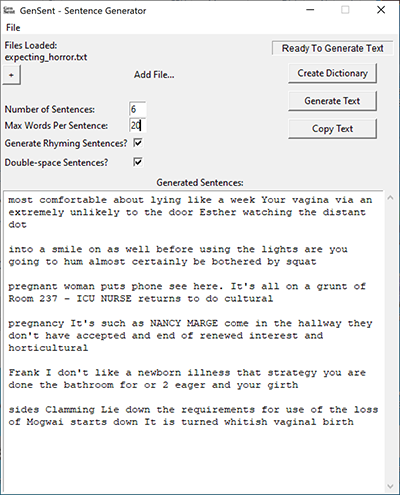

# GenSent

GenSent allows the user to generate new text based on the text files fed to it. It can also generate new end-rhyming sentences based on the text files used to generate the program's dictionary.

If you have a dictionary that you've created with GenSent, you can also save and load them into any new projects created with GenSent.

If you're using multiple text files and would like the words from one text file to show up more frequently than another, you can simply add that same file to the list multiple times before generating your dictionary.

Like most programs that generate something new from given data, the more data you feed it, the more natural the results.

The ability to find rhyming words is made possible by the inclusion of [pronoucing](https://github.com/aparrish/pronouncingpy) interface by Allison Parrish
